# FinTrack Fintech Dashboard

FinTrack is a Flutter fintech UI assessment project that implements a dashboard home, profile drawer, cards management flow, and card-transaction analytics detail screen inside the existing `lib/src/...` architecture.

## Overview

- Dashboard home replaces the previous sample home screen.
- Cards is wired as the second bottom-nav tab.
- Card transaction detail is reachable through `AppRouter.cardTransactionScreen`.
- Profile drawer opens from the dashboard menu button and overlays the home screen.
- Typography is app-wide `Arimo`.
- Theme support includes light and dark palettes, with dark mode as the default launch theme.
- Iconography for the new fintech surfaces uses `lucide_icons_flutter` for most actions and settings.

## Demo Recordings

The recordings below showcase the project running through the dashboard, transaction filters, profile drawer, card controls, virtual-card switch, card settings, and transaction-detail chart.

### Android Emulator

<video src="docs/features/fintech_dashboard_cards/media/android-emulator-demo.mp4" controls width="320"></video>

[Open Android emulator demo](docs/features/fintech_dashboard_cards/media/android-emulator-demo.mp4)

### iOS Simulator

<video src="docs/features/fintech_dashboard_cards/media/ios-simulator-demo.mp4" controls width="320"></video>

[Open iOS simulator demo](docs/features/fintech_dashboard_cards/media/ios-simulator-demo.mp4)

## Screenshots

### Dark Mode

<p>
  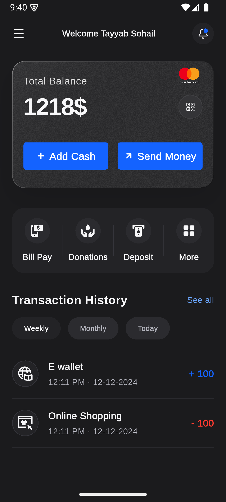
  
  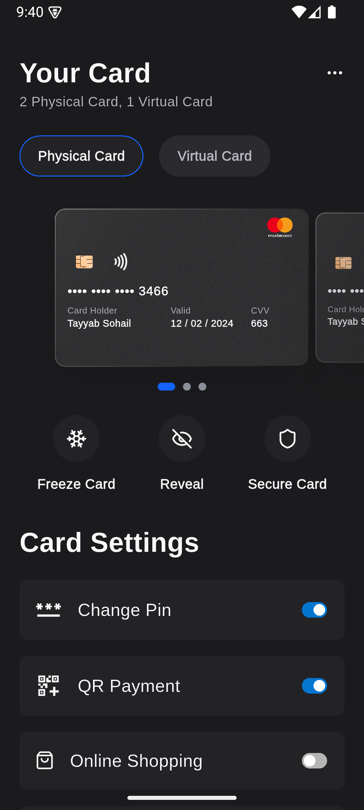
  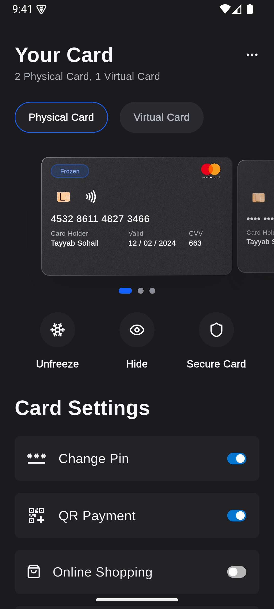
  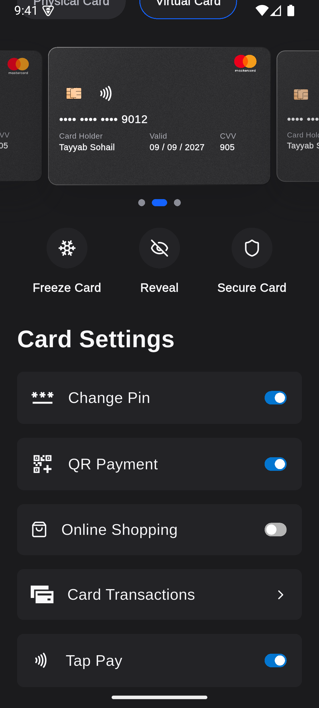
  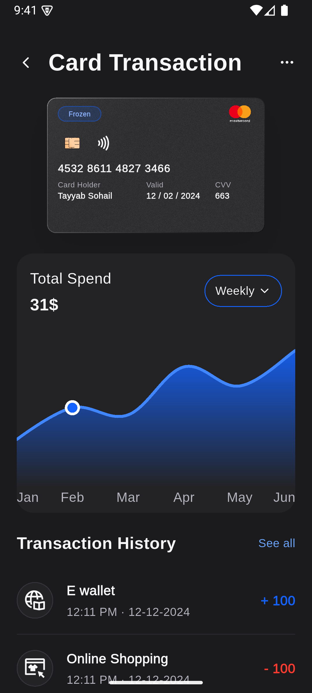
</p>

### Light Mode

<p>
  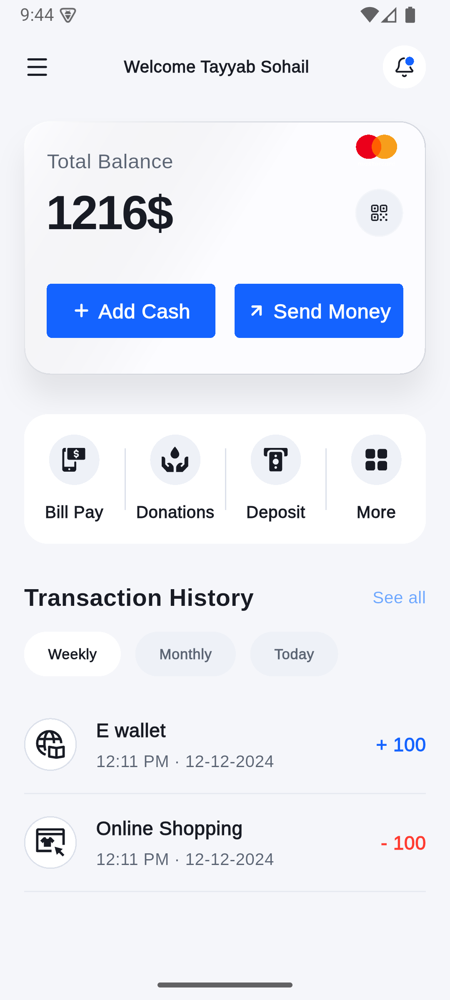
  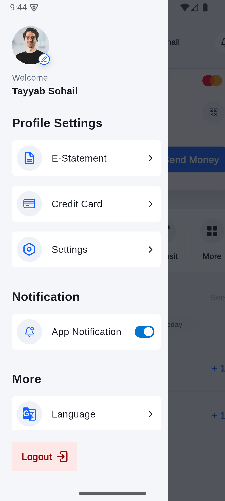
  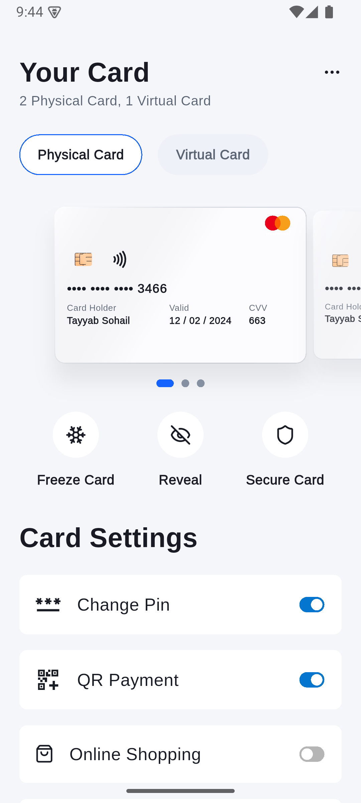
  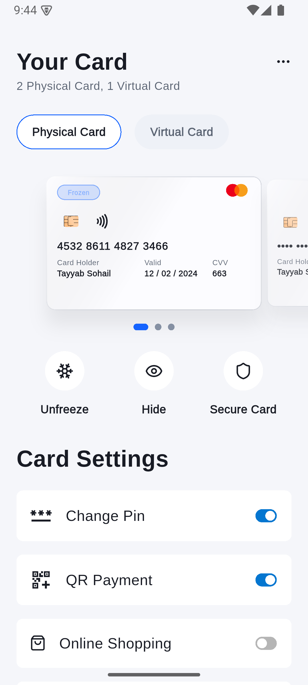
  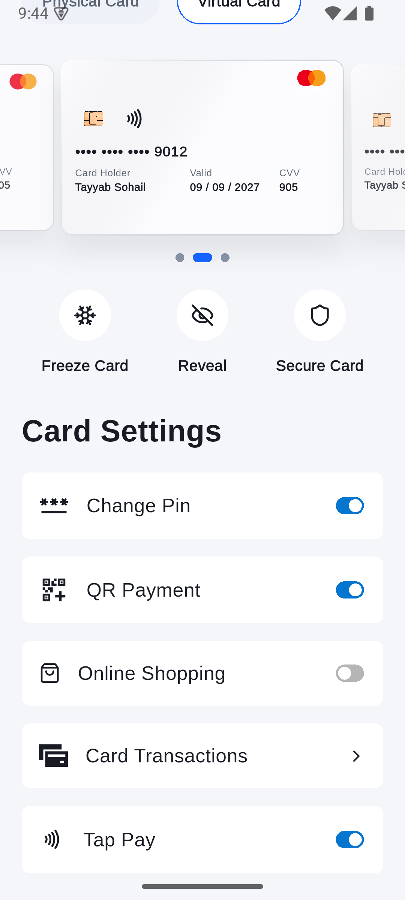
  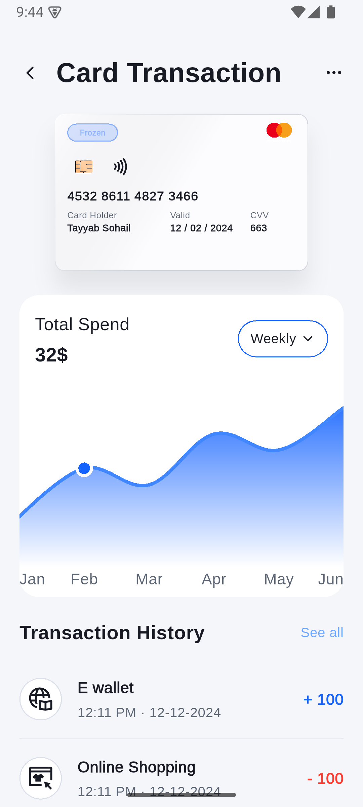
</p>

More screenshots are available in:

- `docs/features/fintech_dashboard_cards/images/dark/`
- `docs/features/fintech_dashboard_cards/images/light/`

## Features

- Dashboard home with live mocked financial snapshot data.
- Profile drawer with user summary, profile settings, notification toggle, and cards navigation.
- Cards screen with physical/virtual card filters, carousel, freeze/reveal controls, and card settings toggles.
- Card transaction detail with selected card preview, total spend chart, weekly/monthly range toggle, and transaction history.
- Pull-to-refresh on dashboard, cards, and transaction-detail screens.
- Staggered reveal animations, animated currency values, responsive layout fixes, and system light/dark theme support.

## Setup

1. Install Flutter `3.38.5` or a compatible stable version with Dart `3.10.x`.
2. Install iOS and Android platform tooling if you want to run both targets.
3. Fetch dependencies:

```bash
flutter pub get
```

4. Run the app:

```bash
flutter run
```

5. Run a specific device:

```bash
flutter devices
flutter run -d <device-id>
```

## Verification

```bash
flutter analyze
flutter test
flutter test integration_test/fintech_demo_flow_test.dart -d emulator-5554
flutter drive --driver=test_driver/integration_test.dart --target=integration_test/fintech_demo_flow_test.dart -d <ios-simulator-id>
```

The integration flow is used to reproduce the README recordings and screenshots. It drives the app through the major user-facing feature states with deterministic mock data.

## Implementation Notes

- Shared fintech data lives in `lib/src/application/model/fintech_dashboard_snapshot.dart`.
- Mock live data and repository wiring live in `lib/src/application/repositories/fintech/`.
- Riverpod UI state is split across `dashboardUiProvider`, `profileDrawerUiProvider`, and `cardsUiProvider`.
- Feature UI stays under `lib/src/features/home/views/...` and `lib/src/features/cards/views/...`.
- Shared fintech widgets live under `lib/src/general_widgets/`.
- Theme mode follows the platform/system setting while both light and dark palettes are implemented.
- Android media was captured on `sdk gphone64 arm64`; iOS media was captured on an `iPhone 16 Pro` simulator. The wireless physical iPhone was detected, but command-line video capture is available for simulators in this environment.

## Documentation

- Feature docs: `docs/features/fintech_dashboard_cards/`
- Submission/media notes: `docs/features/fintech_dashboard_cards/submission.md`
- Agent docs: `.ai/documentation/features/fintech_dashboard_cards/`

## Known Limitations

- Drawer actions other than notification toggle and cards navigation are UI placeholders for the assessment scope.
- The data layer intentionally uses mocked live updates and simulated recoverable failures; no backend integration is included.
- Local video embeds may render as links on some Markdown viewers. The MP4 files are committed under `docs/features/fintech_dashboard_cards/media/` for direct playback.
