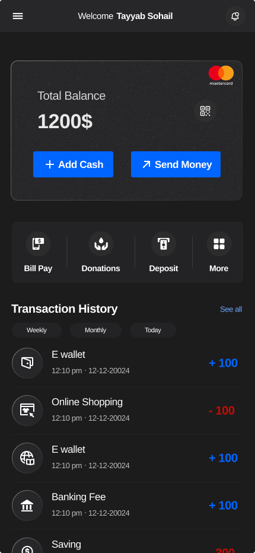
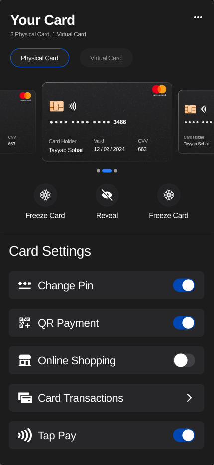
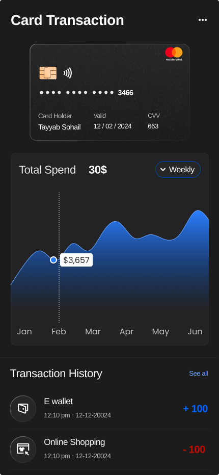
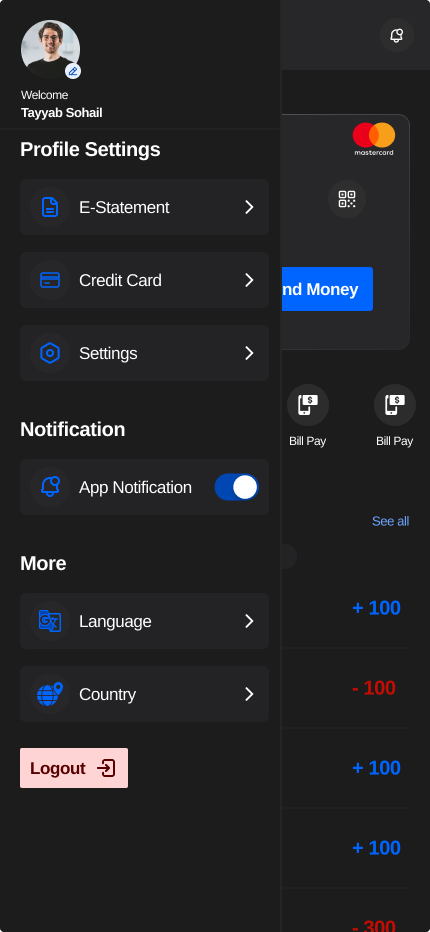

# Fintech Dashboard, Cards, and Profile Drawer

This project now ships a screenshot-driven fintech experience built inside the existing `lib/src/...` architecture. The implementation covers the dashboard home, cards tab, card-transaction detail, and the profile drawer, with mocked live data, Riverpod state, light/dark theme support, and verification coverage.

## Overview

- Dashboard home replaces the previous sample home screen.
- Cards is wired as the second bottom-nav tab.
- Card transaction detail is reachable through `AppRouter.cardTransactionScreen`.
- Profile drawer opens from the dashboard menu button and overlays the home screen.
- Typography is app-wide `Arimo`.
- Theme support includes light and dark palettes, with dark mode as the default launch theme.
- Iconography for the new fintech surfaces uses `lucide_icons_flutter` for most actions and settings.

## Screen Preview

These are the screenshot references used to replicate the feature surfaces in this pass.






## Setup

```bash
flutter pub get
flutter run
```

## Verification

```bash
flutter analyze
flutter test
```

Current verification status:

- `flutter analyze`: passing
- `flutter test`: passing

## Architecture Notes

- The implementation keeps the repo's current architecture instead of creating a parallel template structure.
- Shared fintech data lives in `lib/src/application/model/fintech_dashboard_snapshot.dart`.
- Mock live data and repository wiring live in `lib/src/application/repositories/fintech/`.
- Feature UI state is split into small Riverpod notifiers:
  - `dashboardUiProvider`
  - `profileDrawerUiProvider`
  - `cardsUiProvider`
- Presentation stays feature-scoped:
  - `lib/src/features/home/views/...`
  - `lib/src/features/cards/views/...`
- Reusable fintech widgets live under `lib/src/general_widgets/`.

## Packages Used

- `flutter_riverpod`: feature and screen state management
- `fl_chart`: spend trend chart on card-transaction detail
- `lucide_icons_flutter`: line icon system for most new screens
- `google_fonts`: app-wide `Arimo` typography
- `equatable`: immutable model equality for the shared fintech snapshot

## Feature Highlights

- Stream-driven mocked dashboard snapshot with 500-800ms initial delay, 3-second updates, and recoverable error simulation
- Pull-to-refresh on dashboard, cards, and card-transaction detail
- Staggered reveal animations and animated currency value updates
- Shared bank-card component reused across home, cards, and detail views
- Responsive layout fixes for narrower widths and shorter heights
- Profile drawer notification toggle backed by Riverpod state

## Testing Coverage

The feature adds more than ten meaningful tests across unit and widget suites.

- Unit coverage
  - snapshot/mock/copyWith/serialization
  - repository update and retry behavior
  - theme defaults
  - dashboard, drawer, and cards UI-state notifiers
- Widget coverage
  - loading, success, and error states on home
  - profile drawer rendering and notification toggle
  - cards screen rendering
  - card-transaction detail rendering
  - registered-route navigation into the detail screen

## Documentation

- Human docs: `docs/features/fintech_dashboard_cards/`
- Agent docs: `.ai/documentation/features/fintech_dashboard_cards/`

## Known Limitations

- The README includes screenshot previews for the implemented surfaces, but it does not yet include a fresh simulator/device runtime recording GIF.
- Drawer list actions other than switching to the cards tab are demo placeholders in this assessment pass.
- The mock data layer simulates live updates and recoverable failures, but there is no backend integration in scope.
